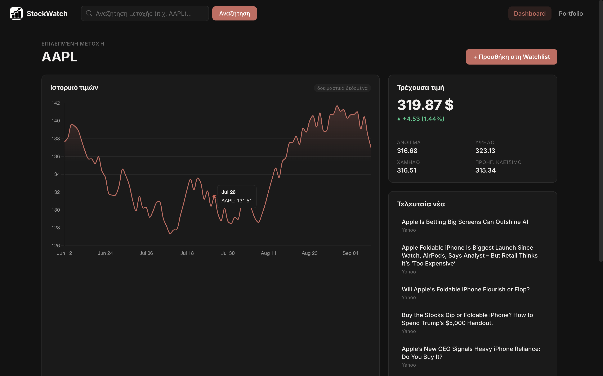
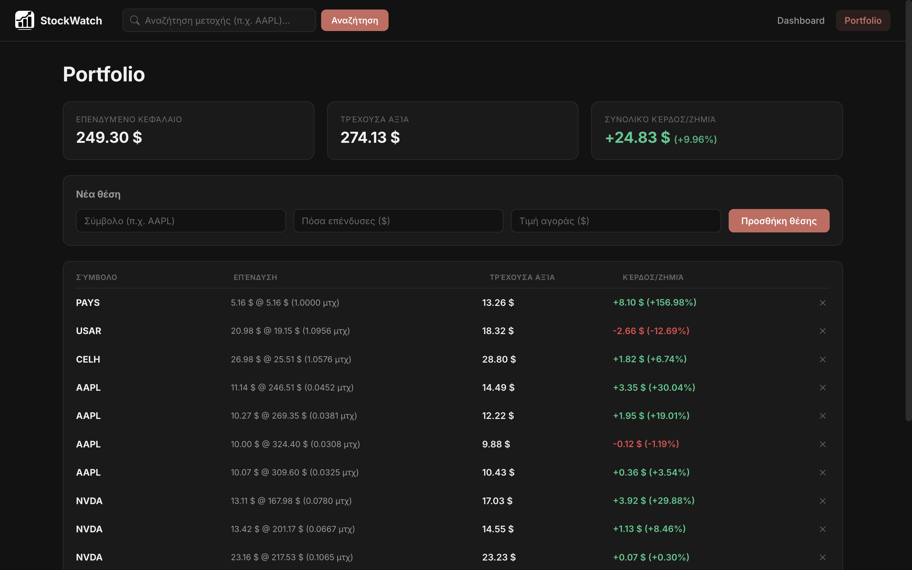
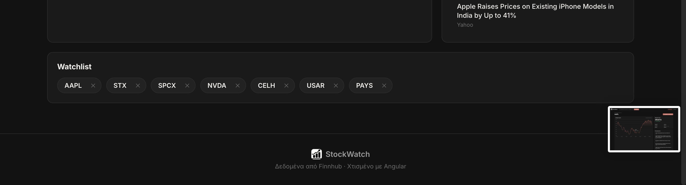

# StockWatch

A stock-tracking dashboard built with Angular — search any stock symbol, view live price data and company news, keep a watchlist, and track a personal portfolio with real-time profit/loss calculations.

<p>
  
  
</p>
<p>
  
</p>

## What it does

- **Search & dashboard** — look up any stock symbol (e.g. `AAPL`, `MSFT`, `TSLA`) and see a price chart, live quote, and recent company news on one screen.
- **Watchlist** — save symbols you care about, persisted locally, one click to jump back to them.
- **Portfolio tracking** — log how much money you invested in a stock and at what price; the app fetches the current price and computes live gain/loss per position and across your whole portfolio (fractional shares supported — no need to have bought whole shares).
- **Live data** — quotes and news come from the [Finnhub](https://finnhub.io/) API.

## Tech stack

| Layer | Choice |
|---|---|
| Framework | [Angular 22](https://angular.dev/) — standalone components, no NgModules |
| State | Angular **signals** (`signal`, `computed`, `effect`) — no external state library |
| Async data | Angular's **`resource()`** API, tied directly to component input signals |
| Rendering | Server-side rendering + hydration + build-time prerendering (`@angular/ssr`) |
| Charts | [Chart.js](https://www.chartjs.org/) |
| HTTP | Angular `HttpClient`, `Finnhub` REST API |
| Forms | Angular template-driven forms (`ngModel`) |
| Styling | Hand-written CSS with a small design-token system (CSS custom properties) — no UI framework |
| Language | TypeScript |
| Tests | Vitest (scaffolded per component) |

## Architecture notes

- **Standalone components throughout.** Every component (`Header`, `Dashboard`, `StockChart`, `StockPrices`, `StockNews`, `Watchlist`, `Portfolio`, `PortfolioPosition`, `Footer`) declares its own `imports` — no `NgModule` boilerplate.
- **Signal-based "stores" instead of NgRx.** State that needs to be shared or survive a page reload (`WatchlistStore`, `PortfolioStore`, `SelectedStockStore`) lives in small injectable services built around a single `signal`, with `effect()` syncing to `localStorage`. Each store is SSR-safe (`isPlatformBrowser` guards, since `localStorage` doesn't exist on the server during prerendering).
- **Data flows down, events flow up.** Parent components read shared state and pass it into children via `input()`; children report back via `output()` (e.g. clicking a watchlist symbol, or a portfolio row reporting its live value up to the portfolio total).
- **`resource()` for async state.** Each data-fetching component (`StockPrices`, `StockNews`, `StockChart`, `PortfolioPosition`) ties its HTTP call to a `resource()` keyed on an input signal — the request automatically re-runs whenever the selected symbol changes, with `isLoading()` / `error()` / `value()` handled declaratively in the template.
- **One shared `Stock` service** wraps all Finnhub endpoints (quote, symbol search, candles, company news) behind typed methods, so components never touch the HTTP layer directly.

## Known trade-offs

- Historical price data (the chart) currently uses **generated mock data**, because Finnhub's free tier restricts the `/stock/candle` endpoint for equities. Live quotes and news are real. Swapping in a real historical-data provider only requires changing the `resource()` loader in `stock-chart.ts`.
- No backend — watchlist and portfolio persist to `localStorage`, scoped to one browser.

## Running it locally

```bash
npm install
```

Create `src/environments/environment.ts` (gitignored) with a free API key from [finnhub.io](https://finnhub.io/register):

```ts
export const environment = {
  finnhubApiKey: 'YOUR_KEY_HERE',
};
```

```bash
npm start
```

Then open `http://localhost:4200`.

### Other scripts

```bash
npm run build   # production build (SSR + prerendering)
npm test        # unit tests (Vitest)
```

## Possible next steps

- Real historical price provider (e.g. Twelve Data) for the chart
- Symbol autocomplete on search, backed by Finnhub's `/search` endpoint
- Persist watchlist/portfolio to a backend + auth, instead of `localStorage`
- Unit tests for the signal stores and computed gain/loss logic
